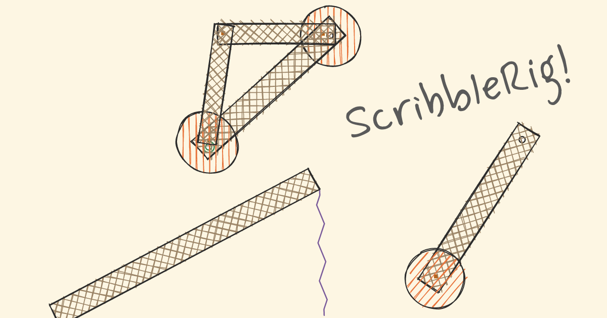

# ScribbleRig



A browser-based 2D physics sandbox in the spirit of *The Incredible Machine* —
drop bodies into a room, connect them with springs, motors, welds, and pins, hit
**Play**, and watch physics unfold. Everything is rendered in a hand-drawn doodle
style, and a whole creation packs into a shareable URL — no account, no sign-in.
A small Cloudflare Worker mints optional named shortlinks (`/s/<id>`) and renders
OG previews; the URL-share path keeps working unchanged.

**[Try it →](https://scribblerig.josnun.com)**

## Features

- **Bodies & connectors** — place balls and platforms; join them with springs,
  motors (live-tunable while running), welds, and pins.
- **Build vs. run** — edit the design while paused; Play compiles it into a live
  simulation and Reset replays it identically.
- **Hand-drawn rendering** — [Rough.js](https://roughjs.com) doodles over a
  paper grid, with stable (non-shimmering) line wobble.
- **Pan & zoom**, optional grid snapping, and a mobile-friendly bottom-sheet UI.
- **URL-encoded sharing** — the scene is encoded straight into the URL, and
  decoding is tolerant so links keep working as the format evolves. A Cloudflare
  Worker mints optional named shortlinks (backed by KV) with OG previews;
  un-named scenes never touch a backend.
- **Per-tab sessions + autosave** — each tab holds its own build, with a Builds
  list (thumbnails) to reopen past creations.

## Tech stack

Vite · TypeScript · React · [Rapier](https://rapier.rs) (2D, WASM) for physics ·
Rough.js for rendering · Vitest for tests. Physics units are meters; the renderer
scales to pixels.

## Development

This project uses [bun](https://bun.sh).

```sh
bun install      # install dependencies
bun run dev      # start the Vite dev server
bun run build    # type-check and build for production
bun run test     # run the test suite (vitest run)
```

## Architecture

The **design graph** (the serializable scene) is the source of truth; the live
simulation is a disposable instance compiled from it on Play and discarded on
Reset. The physics engine is fully encapsulated by the `sim` module, so it stays
swappable.

- [`CONTEXT.md`](CONTEXT.md) — domain glossary and module map.
- [`docs/adr/`](docs/adr) — architecture decision records.
- [`.scratch/scribblerig/`](.scratch/scribblerig) — the PRD and issue tracker.

## License

ScribbleRig is licensed under the [GNU Affero General Public License v3.0](LICENSE)
— © 2026 Josiah Nunemaker.
